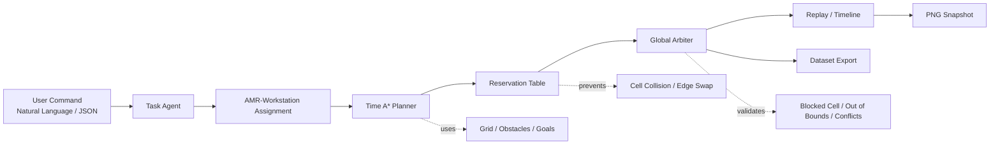

# FleetMind Studio

FleetMind Studio는 다중 AMR 작업 배정, Time A* 경로 계획, Reservation Table 기반 충돌 방지, Global Arbiter 검증, 실행 리플레이, 합성 데이터 추출을 하나로 통합한 웹 기반 Fleet Planning Studio입니다. 20x20 이상 Grid에서 AMR, Workstation, Obstacle, Goal을 직접 편집하고, 자연어/JSON 명령으로 다중 AMR 작업을 배정한 뒤 경로를 생성·검증·재생할 수 있습니다.

<!-- SUBMISSION_LINKS_START -->

## Project Links

| Item | Link |
|---|---|
| Live Demo | https://fleet-mind-studio.vercel.app/ |
| Demo Video | https://youtu.be/WXZCSgPqJbQ |
| Source Code | https://github.com/sungwung1201/FleetMind-Studio |

## Project Documentation

- [Evaluation Mapping](docs/EVALUATION_MAPPING.md)
- [3-Minute Demo Script](docs/DEMO_SCRIPT_3MIN.md)
- [Performance Notes](docs/PERFORMANCE_NOTES.md)
- [Known Limitations](docs/KNOWN_LIMITATIONS.md)
- [Deployment Guide](docs/DEPLOYMENT.md)
- [Dataset Schema](dataset/DATASET_SCHEMA.md)
- [Data Collection Business Model](docs/DATA_COLLECTION_BUSINESS_MODEL.md)

<!-- SUBMISSION_LINKS_END -->

## 1. Quick Start

```bash
npm install
npm run dev
```

브라우저에서 Vite가 출력하는 주소를 연다.

```text
http://localhost:5173/
```

프로젝트 검증 명령은 다음 3개입니다.

```bash
npm run build
npm run lint
npm run validate
```

정상 기대 결과:

```text
build PASS
lint PASS
validate PASS
```

## 2. 핵심 사용 순서

1. `Edit > Add` 클릭
2. `Build`에서 `AMR / Workstation / Goal / Wall` 선택
3. Grid를 클릭하거나 좌클릭을 누른 채 드래그하여 연속 배치
4. `Agent` 입력창에 자연어 또는 JSON 명령 입력
5. `Plan Only` 실행
6. Agent Log, Reservation Log, Arbiter Log 확인
7. `Start Fleet / Play`로 tick replay 확인
8. `Dataset > Export / PNG / Validate`로 실행 결과 데이터 생성

## 3. 자연어 / JSON 명령 예시

자연어:

```text
모든 작업대를 가장 가까운 AMR로 채워줘
작업대 3 먼저 채우고 작업대 1도 처리해
W1, W2, W3를 가까운 AMR 순서로 배정해줘
```

JSON:

```json
{
  "fill": ["W1", "W2", "W3"],
  "priority": "nearest"
}
```

우선순위 기반 JSON:

```json
{
  "fill": ["W3", "W1"],
  "priority": "input_order"
}
```

## 4. 평가 기준 대응표

| 평가 요구사항 | 구현 여부 | 확인 위치 | 시연 방법 |
|---|---:|---|---|
| 20x20 이상 Grid | O | `src/scenarios/defaultScenario.ts` | 화면 Grid / Fleet Stats 확인 |
| AMR 3대 이상 | O | `defaultScenario.ts`, `GridCanvas.tsx` | AMR_01~AMR_03 표시 확인 |
| Workstation 3개 이상 | O | `defaultScenario.ts` | W1~W3 표시 확인 |
| Obstacle 5개 이상 | O | `defaultScenario.ts` | OBS 표시 확인 |
| AMR/WS/Goal/Wall 편집 | O | `src/App.tsx`, `src/ui/GridCanvas.tsx` | Add + Build 버튼으로 추가 |
| 연속 추가/삭제 | O | `src/App.tsx` | Add/Delete 상태에서 좌클릭 드래그 |
| 자연어 Agent | O | `src/core/taskAgent.ts` | 자연어 입력 후 Plan Only |
| JSON Agent | O | `taskAgent.ts` | JSON 명령 입력 후 Plan Only |
| Time A* | O | `src/core/timeAstar.ts` | Planner Log에서 Time A* path 확인 |
| Reservation Table | O | `src/core/reservationTable.ts` | Reservation Log 확인 |
| Edge swap 차단 | O | `reservationTable.ts`, `globalArbiter.ts` | Edge Swap Scenario 실행 |
| Wait vs Detour 판단 | O | `src/core/pathCost.ts` | Bottleneck Scenario에서 wait/detour 로그 확인 |
| Global Arbiter | O | `src/core/globalArbiter.ts` | Arbiter APPROVED/REJECTED 로그 확인 |
| Replay | O | `src/App.tsx`, `ViewTimelineControls.tsx` | Start Fleet / tick 이동 확인 |
| Dataset JSON Export | O | `src/dataset/episodeLogger.ts` | Dataset > Export |
| PNG Snapshot Export | O | `src/dataset/snapshotExporter.ts` | Dataset > PNG |
| Dataset Validate | O | `dataset/validate.js` | `npm run validate` |
| Scenario Export/Import | O | `src/scenarios/scenarioIO.ts` | Export Scenario / Import Scenario |

## 5. 시스템 아키텍처



## 6. 제출용 시나리오

| 시나리오 | 목적 | 파일 | 증거 데이터 |
|---|---|---|---|
| Default Fleet Scenario | 기본 기능 시연 | `src/scenarios/defaultScenario.ts` | `dataset/episodes/default_episode.json` |
| Edge Swap Prevention Scenario | 마주보는 AMR의 edge swap 방지 | `src/scenarios/edgeSwapScenario.ts` | `dataset/episodes/edge_swap_episode.json` |
| Bottleneck Wait vs Detour Scenario | 좁은 통로에서 wait/detour 판단 | `src/scenarios/bottleneckScenario.ts` | `dataset/episodes/bottleneck_episode.json` |
| No Path / Blocked Target Scenario | 실패 상황 처리 로그 확인 | `src/scenarios/noPathScenario.ts` | `dataset/episodes/no_path_episode.json` |

Snapshot 증거는 다음 위치에 있다.

```text
dataset/snapshots/default_snapshot.png
dataset/snapshots/edge_swap_snapshot.png
dataset/snapshots/bottleneck_snapshot.png
dataset/snapshots/no_path_snapshot.png
```

## 7. 데모 영상 권장 구성

| 시간 | 화면 | 말할 내용 |
|---:|---|---|
| 0:00~0:15 | 전체 UI | 20x20 Grid 기반 AMR Fleet Studio |
| 0:15~0:35 | Add/Delete/Goal/Wall | 객체 편집과 연속 드래그 편집 |
| 0:35~0:55 | Agent Console | 자연어/JSON 명령 입력 |
| 0:55~1:15 | Logs | Time A*, Reservation Table, Global Arbiter |
| 1:15~1:35 | Replay | 다중 AMR 동시 이동 |
| 1:35~1:50 | Dataset | JSON/PNG export와 validate |

상세 대본은 `docs/DEMO_SCRIPT.md`에 정리했다.

## 8. 코드 구조

```text
src/App.tsx                         전체 화면/툴바/Agent/Planner/Replay 연결
src/ui/GridCanvas.tsx               Grid 렌더링 및 편집 인터랙션
src/ui/AgentDrawer.tsx              Agent 패널
src/ui/SceneTreeInspector.tsx       Scene/Inspector 패널
src/ui/ViewTimelineControls.tsx     Replay/Timeline 조작
src/core/taskAgent.ts               자연어/JSON 파싱 및 AMR-Workstation 배정
src/core/timeAstar.ts               Time A* 경로 탐색
src/core/reservationTable.ts        Cell/Edge Reservation Table
src/core/globalArbiter.ts           Fleet plan 검증
src/core/pathCost.ts                Wait vs Detour 비용 로그
src/dataset/episodeLogger.ts        Dataset JSON 생성/검증
src/dataset/snapshotExporter.ts     PNG snapshot 생성
src/scenarios/scenarioIO.ts         Scenario export/import
```

## 9. Project Checklist

- [x] 20x20 이상 Grid
- [x] AMR 3대 이상
- [x] Workstation 3개 이상
- [x] Obstacle 5개 이상
- [x] 자연어/JSON Agent 명령
- [x] Time A*
- [x] Reservation Table
- [x] Edge swap 차단
- [x] Global Arbiter
- [x] Wait vs Detour 로그
- [x] Replay
- [x] Dataset JSON export
- [x] PNG snapshot export
- [x] validate script 및 샘플 dataset
- [x] Default / Edge Swap / Bottleneck / No Path 증거 시나리오
- [x] Project requirement mapping
- [x] Demo scenario guide

## AI Tool Usage

ChatGPT was used as a development assistant during the project, but the implementation was not submitted as unreviewed AI-generated code.

AI assistance was used for:
- reviewing TypeScript/React code structure
- debugging planner, reservation, and arbiter edge cases
- organizing README and documentation
- preparing evaluation-mapping and demo-script documentation
- refining scenario validation and submission evidence

The developer performed the core implementation decisions, local testing, scenario validation, UI integration, GitHub deployment, Vercel deployment, and final verification.

FleetMind Studio uses a deterministic rule-based Agent instead of exposing external LLM API keys in the frontend. This keeps the public demo reproducible, safe to deploy, and free from API-key leakage risk.

