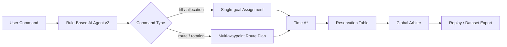

# AI Agent v2: Rule-Based Hybrid Fleet Mission Parser

The deployed Robot Fleet Web Studio demo uses a local rule-based AI Agent. It does not require external LLM APIs, internet access, or API keys.

## Why not GPT/Gemini in the deployed frontend?

The app is a Vite React client-side app. Any API key embedded in frontend code or `VITE_*` environment variables can be exposed to the browser bundle. To keep deployment safe, the public demo uses only local parsing logic.

## Supported command classes

### 1. General allocation

```txt
모든 작업대를 가장 가까운 AMR로 채워줘
W1부터 W3까지 가까운 AMR로 처리해
W2 빼고 나머지 작업대 채워줘
```

### 2. Explicit robot route

```txt
1번 로봇이 2번 갔다가 3번 가
AMR_02는 W1 먼저 갔다가 W3 가고 AMR_01은 W2 가
```

### 3. Rotation assignment

```txt
로테이션으로 1번은 W1, 2번은 W2, 3번은 W3 보내
```

### 4. JSON route command

```json
{
  "routes": [
    { "amrId": "AMR_01", "waypoints": ["W2", "W3"] },
    { "amrId": "AMR_02", "waypoints": ["W1"] }
  ]
}
```

## Execution pipeline



## Safety statement

No external API key is included in the deployed app. If a future server-side LLM parser is added, it should be implemented behind a protected backend endpoint, never inside the frontend bundle.
